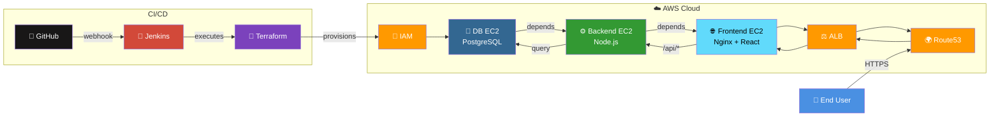

# Visualization Prompt for CI/CD Workflow with Jenkins & Terraform

Copy and paste this prompt into your AI visualization tool (Claude, ChatGPT, Mermaid Live Editor, etc.) to generate a comprehensive workflow diagram.

---

## 📊 Prompt for High-Level Workflow Visualization

```
Create a high-level workflow diagram showing CI/CD pipeline with Jenkins deploying a 3-tier application using Terraform on AWS.

USE OFFICIAL LOGOS/ICONS for:
- GitHub logo
- Jenkins logo
- Terraform logo (purple)
- AWS logo
- EC2 icon
- Application Load Balancer (ALB) icon
- Route53 icon
- PostgreSQL elephant logo
- Node.js logo
- React logo
- Nginx logo
- Let's Encrypt logo

WORKFLOW (Left to Right or Top to Bottom):

**Phase 1: CI/CD Trigger**
[GitHub Logo] → (webhook) → [Jenkins Logo]
Label: "Code Push triggers Pipeline"

**Phase 2: Infrastructure as Code**
[Jenkins Logo] → [Terraform Logo] → [AWS Logo]
Label: "Terraform provisions infrastructure"
Show S3 bucket icon for state storage

**Phase 3: AWS Resources (inside AWS cloud boundary)**
[Terraform Logo] creates:

1. [IAM Icon] - IAM Roles
   └─ For SSL certificate automation

2. [EC2 Icon] - Database Server
   └─ [PostgreSQL Logo]
   └─ "Private Subnet"

3. [EC2 Icon] - Backend Server  
   └─ [Node.js Logo]
   └─ "Private Subnet"
   └─ Arrow showing dependency on Database

4. [EC2 Icon] - Frontend Server
   └─ [Nginx Logo] + [React Logo]
   └─ [Let's Encrypt Logo] for SSL
   └─ "Private Subnet"
   └─ Arrow showing dependency on Backend

5. [ALB Icon] - Load Balancer
   └─ "Public Subnet"
   └─ HTTPS/HTTP listeners

6. [Route53 Icon] - DNS
   └─ Points to ALB

**Phase 4: Application Access**
[User Icon] → [Route53 Icon] → [ALB Icon] → [Frontend EC2] → [Backend EC2] → [Database EC2]

DESIGN NOTES:
- Use brand colors for each technology
- Show AWS resources inside a cloud boundary
- Use arrows to show data/deployment flow
- Keep it simple - maximum 10-12 elements
- Add small labels but rely mostly on icons
- Show dependencies with dotted lines
- Group related components

Make it visually appealing, modern, and easy to understand at a glance for presentations.
```

---

## 🎨 Alternative: Simple Icon-Based Prompt

```
Create a minimalist DevOps workflow diagram using official brand logos:

Layout: Left to Right Flow

[GitHub Logo] --webhook--> [Jenkins Logo] --executes--> [Terraform Logo] --provisions--> [AWS Cloud]

Inside AWS Cloud (draw cloud boundary):
┌─────────────────────────────────────────┐
│  [IAM Icon] IAM Role                    │
│                                         │
│  [EC2] PostgreSQL    (Database Tier)    │
│         ↓                               │
│  [EC2] Node.js       (API Tier)         │
│         ↓                               │
│  [EC2] Nginx+React   (Web Tier)         │
│         ↓                               │
│  [ALB] Load Balancer (Public)           │
│         ↓                               │
│  [Route53] DNS                          │
└─────────────────────────────────────────┘

[End User] --HTTPS--> [Route53] --> [ALB] --> [EC2 Frontend] --> [EC2 Backend] --> [EC2 Database]

Use official logos, minimal text, clean lines, modern design.
Brand colors: Jenkins (red), Terraform (purple), AWS (orange), Node.js (green), React (blue).
```

---

## 📝 Simplified Mermaid Code (Icon-Based)

You can paste this into Mermaid Live Editor (https://mermaid.live):



---

## 🎯 How to Use This

### Option 1: AI Tools (Claude, ChatGPT with Canvas/Artifacts)
1. Copy the main icon-based prompt
2. Paste into Claude or ChatGPT
3. Request: "Create this as a visual diagram"
4. Export the generated image

### Option 2: Mermaid Live Editor
1. Go to https://mermaid.live
2. Paste the Mermaid code above
3. Customize colors/icons as needed
4. Export as PNG/SVG

### Option 3: Presentation Tools (PowerPoint, Google Slides)
1. Insert brand logos from official websites
2. Use SmartArt or shapes for flow
3. Follow the structure in the prompt
4. Add arrows and labels

### Option 4: Diagram Tools (Draw.io, Lucidchart, Excalidraw)
1. Import or insert brand logos
2. Create boxes for each component
3. Connect with arrows showing flow
4. Group AWS resources in cloud boundary

---

## 📚 Quick Reference

### Icon Resources
- **AWS Icons**: https://aws.amazon.com/architecture/icons/
- **Jenkins Logo**: https://www.jenkins.io/artwork/
- **Terraform Logo**: https://www.terraform.io/brand
- **Node.js Logo**: https://nodejs.org/en/about/branding
- **React Logo**: https://react.dev/community/logos
- **PostgreSQL**: https://wiki.postgresql.org/wiki/Logo
- **Nginx**: https://www.nginx.com/press/
- **Font Awesome Icons**: https://fontawesome.com/ (for generic icons)

### Color Palette
- **GitHub**: #181717 (black)
- **Jenkins**: #D24939 (red)
- **Terraform**: #7B42BC (purple)
- **AWS**: #FF9900 (orange)
- **PostgreSQL**: #336791 (blue)
- **Node.js**: #339933 (green)
- **React**: #61DAFB (cyan)
- **Nginx**: #009639 (green)

---

## 🎓 For Students - What This Shows

**High-Level Flow**:
1. 📝 Code changes pushed to GitHub
2. 🔧 Jenkins automatically triggered
3. 💜 Terraform provisions infrastructure
4. ☁️ AWS resources created with dependencies
5. 🌍 Application accessible via domain

**Key Concepts**:
- ✅ **CI/CD Automation** - No manual deployment
- ✅ **Infrastructure as Code** - Terraform manages everything
- ✅ **3-Tier Architecture** - Database → API → Web
- ✅ **AWS Best Practices** - Private subnets, ALB, Route53
- ✅ **Automated SSL** - Let's Encrypt with Route53

---

## 🖼️ Example ASCII Visualization

For quick reference in terminal/docs:

```
┌─────────┐      ┌─────────┐      ┌──────────┐      ┌──────────────┐
│ GitHub  │─────▶│ Jenkins │─────▶│Terraform │─────▶│  AWS Cloud   │
└─────────┘      └─────────┘      └──────────┘      │              │
   (Code)          (CI/CD)            (IaC)          │  ┌────────┐  │
                                                     │  │  IAM   │  │
                                                     │  └────────┘  │
                                                     │  ┌────────┐  │
                                                     │  │   DB   │  │
                                                     │  │  EC2   │  │
                                                     │  └────┬───┘  │
                                                     │       ▼      │
                                                     │  ┌────────┐  │
                                                     │  │Backend │  │
                                                     │  │  EC2   │  │
                                                     │  └────┬───┘  │
                                                     │       ▼      │
                                                     │  ┌────────┐  │
                                                     │  │Frontend│  │
                                                     │  │  EC2   │  │
                                                     │  └────┬───┘  │
                                                     │       ▼      │
                                                     │  ┌────────┐  │
                                                     │  │  ALB   │  │
                                                     │  └────┬───┘  │
                                                     │       ▼      │
                                                     │  ┌────────┐  │
                                                     │  │Route53 │  │
                                                     │  └────┬───┘  │
                                                     └───────┼──────┘
                                                             ▼
                                                        ┌─────────┐
                                                        │End User │
                                                        └─────────┘
```
